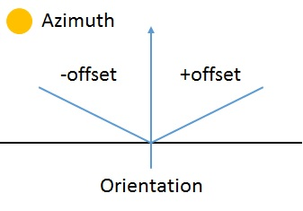
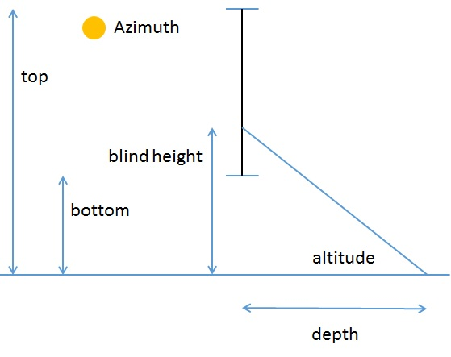

# node-red-contrib-blindcontroller
Is a collection of <a href="http://nodered.org" target="_new">Node-RED</a> nodes that can be used to automated the control of  household roller blinds based on the current position of the sun.

Install
-------

Run the following command in the root directory of your Node-RED install

    npm install node-red-contrib-blindcontroller

Sun Position
------------

This node calculates the position of the sun at a given geo location.  
It is configured with the following properties:
* <b>lat</b>: latitude of the location
* <b>lon</b>: longitude of the location
* <b>start</b>: time of day that constitutes the start of daylight hours
* <b>end</b>: time of day that constitutes the end of daylight hours

This node emits a <b>msg.payload</b> with the following properties:
* <b>sunInSky</b>: boolean value indicating whether it is currently considered daylight hours
* <b>altitude</b>: altitude of the sun above the horizon in degrees
* <b>azimuth</b>: azimuth of the sun in degrees, where 0 is North
* <b>altitudeRadians</b>: altitude of the sun above the horizon in radians
* <b>azimuthRadians</b>: azimuth of the sun in radians, where 0 is South, a positive value is in the west and negative value in the east

The node sets <b>msg.location</b> with the coordinates of the location and <b>msg.topic</b> to "sun".

The node also reports its status within the Node-RED flow editor, using colour to indicate whether it is currently considered daylight hours.

Blind Controller
----------------

This node calculates the appropriate blind position to restrict direct sunlight through the associated window.  This node receives the output of the <b>Sun Position</b> Node.

It is configured with the following properties:
* <b>channel</b>: identifier of the blind - which is used in the emitted <b>msg.payload</b>
* <b>orientation</b>: the bearing representing the perpendicular to the of the window
* <b>negative offset</b>: (optional) anti-clockwise offset from orientation for determination of whether the sun is coming through window
* <b>positive offset</b>: (optional) clockwise offset from orientation for determination of whether the sun is coming through window
* <b>top</b>: measurement from the floor to top of the window covered by the blind
* <b>bottom</b>: measurement from the floor to bottom of the window covered by the blind
* <b>depth</b>: the extent to which direct sunlight is to be allowed into the room through the window, defined as a length on the floor
* <b>altitude threshold</b>: (optional) minimum altitude of the sun for determination of blind position
* <b>increment</b>: the degree to which the blind position can be controlled

The node calculates the appropriate blind position to restrict the amount of direct sunlight entering the room.  This calculation includes:
* determination of whether direct sunlight is entering the room based on the orientation of the blind and the azimuth of the sun - taking into account the negative and positive offset properties; and

* dimensions of the window and the current altitude of the sun.

In the event the node determines a blind position change is required, it will emit a <b>msg.payload</b> with the following properties:
* <b>channel</b>: identifier of the blind
* <b>blindPosition</b>: the new position of the blind

In addition, <b>msg.data</b> includes information useful for monitoring:
* <b>altitude</b>: altitude of the sun in degrees
* <b>azimuth</b>: azimuth of the sun in degrees
* <b>sunInWindow</b>: boolean value indicating whether direct sunlight is entering the room based on the orientation of the blind and the azimuth of the sun - taking into account the negative and positive offset properties

<b>msg.topic</b> is set to "blind".

The node also reports its status within the Node-RED flow editor:
* colour indicates whether it is currently considered daylight hours;
* shape indicates whether the blind is fully closed or not;
* text reports current blind position.

Qmotion
-------

This node prepares a command for Qmotion motorised blinds based on the required blind position.  It consumes the <b>msg.payload</b> emitted from the <b>Blind Controller</b> node and then emits a message with the following properties:
* <b>channel</b>: identifier of the blind
* <b>command</b>: the command in decimal representation associated with the required blind position

Sample Flow
-----------

The figure below represents a sample flow of how the nodes within this modules can be used to control 6 Qmotion blinds at the one geo location.  The flow is initiated by an Injector node configured to run periodically.

